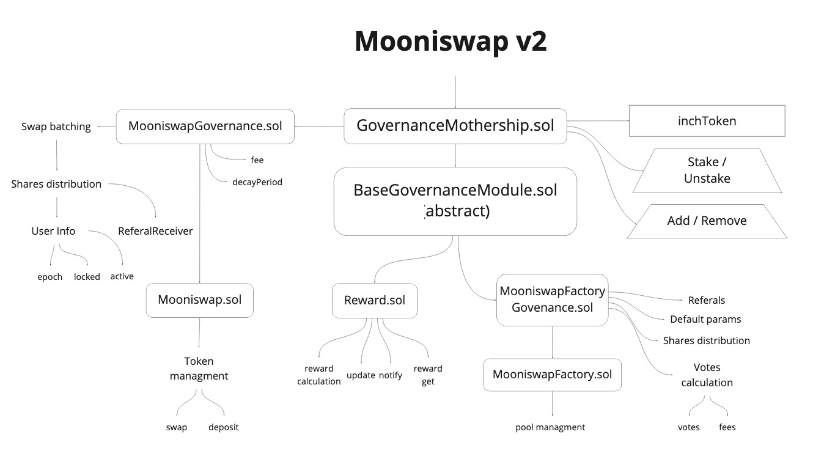

# Mooniswap v2 Tech Spec

<!-- START doctoc generated TOC please keep comment here to allow auto update -->
<!-- DON'T EDIT THIS SECTION, INSTEAD RE-RUN doctoc TO UPDATE -->
<!-- doctoc ./docs/TechSpec.md --github -->

  - [Liquidity Pool (LP)](#liquidity-pool-lp)
  - [Staking program](#staking-program)
  - [Voting (LiquidVoting)](#voting-liquidvoting)
  - [Reward distribution](#reward-distribution)
  - [Referral](#referral)
  - [Features](#features)
- [Logic](#logic)
  - [Reward distribution](#reward-distribution-1)
  - [Fees](#fees)
  - [Governance](#governance)
    - [Pool parameters](#pool-parameters)
    - [Factory parameters](#factory-parameters)
    - [Pool governance](#pool-governance)
    - [Factory Governance](#factory-governance)
- [Technical](#technical)
    - [**GovernanceMothership.sol**](#governancemothershipsol)
- [Code](#code)

<!-- END doctoc generated TOC please keep comment here to allow auto update -->

The protocol focuses on adjusting the parameters of LiquidityPool (LP) by stakeholders by voting. It is possible to add other control modules in the future. 
Users receive voting tokens `LP token` for bringing liquidity to the exchange.

### Liquidity Pool (LP)
- Liquidity Provider
> TODO def

### Staking program

Staking program give ability to `inchToken` holders to vote for values of base parameters of **LiquidityPool** (**LP**). These users also receive $stakeFee$.

Users must lock $InchTokens$ in the contract to participate in the program. These users called **InchStakingHolders** (**ISH**).
**ISH** also rewarded for staking by $StakingFee$.
 
Stakeholders can actively participate in the governance 2:
 - they can vote for default `fee` and `decayPeriod` parameters for LP.
 - they can initiate rewards distribution for stakeholders 
 
Locked quantity of `inchToken` determining the amount of rewards, and the holder's vote's weight.

### Voting (LiquidVoting)

ISH's vote for values of `fee` and `decayPeriod` parameters of LiquidityPool. Votes are average weighted according to locked `inchToken` balance. For users who locked tokens but did not vote the default values are applied.

The weight of each participant's voice is carried by linear interpolation within 24 hours governance grace period (`_VOTING_DECAY_PERIOD`). 

### Reward distribution

A request for distribution can be initiated by any stakeholder and held for all active holdings at the request's time.

Mooniswap users pay fee for exchange. One of them is $StakingFee$. This fee distributed between ISH's proportional to the user investment to reward them for staking.
$$ISHStakingAmount = \frac {ISHLockedInchTokens}{TotalLockedInchTokens} \times StakingFee$$

### Referral
We have a referral program. Users, who invited new users will receive $referralFee$ for each trade of new users.
$refferralFee = referralShare \times TradeFee$

---

### Features

- **Modular principle** - the system is built on the separation of the core and modules that can be managed in `GovernanceMothership`. Currently, there are two modules: 
1. **voting** logic is described as a separate module, 
2. **referral** distribution is the second.
Additional functions can be introduced through the extra modules in the future.

- **Front-Running Attacks protection** - `LiquidVoting.sol` library responsible for taking voting effect with a 24-hour delay on an increasing basis.

- **FlashLoans protection** - The rewards are also issued 

## Logic

:frame_with_picture: 
- GovernanceMothership has two modules:
  - MooniswapFactoryGovernance
  - Rewards

- Module management is restricted to the owner in the current version, but in the future three options will be available:
  - `onlyOwner` (current version)
  - Multisig (planned)
  - Governance (future releases)

### Reward distribution

TBD:

> #### How do rewards count?

A request for distribution can be initiated by any stakeholder and held for all active holdings at the request's time.

### Fees

In Mooniswap V2 we added several fees.

The first one is the **slippage fee**. **Slippage fee** is charged on top of the basic fee. It's equal to some percentage of slippage caused by trade.

First one is slippage fee. Slippage fee is charged on top of basic fee and is equal to some percentage of slippage caused by trade.

Second one is governance fee. Governance fee is charged the same way as referral fee by minting some shares representing percentage of profit the pool made from trade.

### Governance

We also introduced the configuration of all pool parameters via governance. Some parameters are specific to each pool and some are shared over all pools. Mooniswap V2 uses liquid governance to determine the resulting parameters' values. Votes are gradually applied over a fixed period of 1 day.

#### Pool parameters

* `fee` [0% .. 10%]
* `slippageFee` [0% .. 100%] (of slippage)
* `decayPeriod` [15 sec .. 1 hour]

#### Factory parameters

* `defaultFee` [0% .. 10%]
* `defaultSlippageFee` [0% .. 100%] (of slippage)
* `defaultDecayPeriod` [15 sec .. 1 hour]
* `referralFee` [0% .. 25%] (portion of total fee)
* `governanceFee` [0% .. 25%] (portion of total fee)
* `governanceFeeReceiver`

#### Pool governance

LP token holders can vote for fee and decayPeriod. Votes are weighted according to LP balance. For providers who did not vote defaultFee, defaultSlippageFee and defaultDecayPeriod from factory are used.

#### Factory Governance

INCH token holders can lock their tokens in GovernanceMothership which allows to participate in governance and gather fees. Users can vote for 1defaultFee, defaultDecayPeriod, referralFee and governanceFee. Votes are weighted according to locked INCH balance. For users who locked tokens but did not vote the default values are used:
* `fee` = 0
* `slippageFee` = 10%
* `decayPeriod` = 5 min
* `governanceShare` = 0%
* `referralShare` = 5%

## Technical

#### **GovernanceMothership.sol**

This is a root contract, that holds `inchToken` (is an ERC20 token voted by stakeholders, responsible for the number of rewards and determining the holder's vote's weight)

It operates by has 2 two core functions:

- Stake / Ununstake `inchToken`
- Add / Remove Modules

## Code

📂 __mooniswap\-v2__

- 📂 __root__
  - 📄 [**GovernanceMothership.sol**](contracts/inch/GovernanceMothership.sol)
- 📂 __contracts__
  - 📄 [Mooniswap.sol](contracts/Mooniswap.sol)
  - 📄 [MooniswapConstants.sol](contracts/MooniswapConstants.sol) // *Base parameters of the governance mechanics.*
  - 📄 [**MooniswapFactory.sol**](contracts/MooniswapFactory.sol)
  - 📂 __governance__
    - 📄 [**BaseGovernanceModule.sol**](contracts/governance/BaseGovernanceModule.sol)
      // *This is `abstract` class, all the modules have to inherit from this class.*
    - 📄 [GovernanceFeeReceiver.sol](contracts/governance/GovernanceFeeReceiver.sol)
    - 📄 [**MooniswapFactoryGovernance.sol**](contracts/governance/MooniswapFactoryGovernance.sol)
    - 📄 [**MooniswapGovernance.sol**](contracts/governance/MooniswapGovernance.sol)
    - 📄 [**Rewards.sol**](contracts/governance/rewards/Rewards.sol)
  - 📂 __libraries__
    - 📄 [**LiquidVoting.sol**](contracts/libraries/LiquidVoting.sol)
